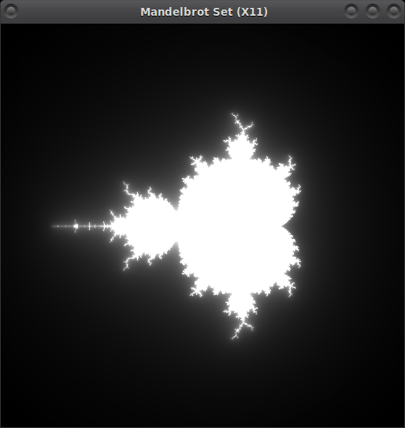
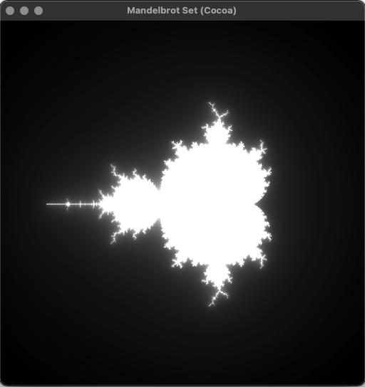
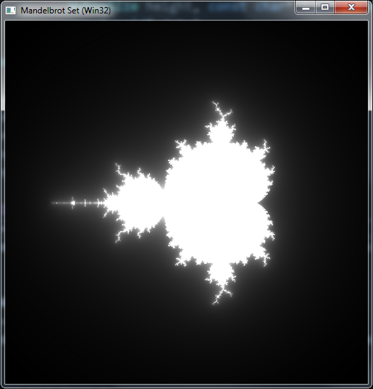
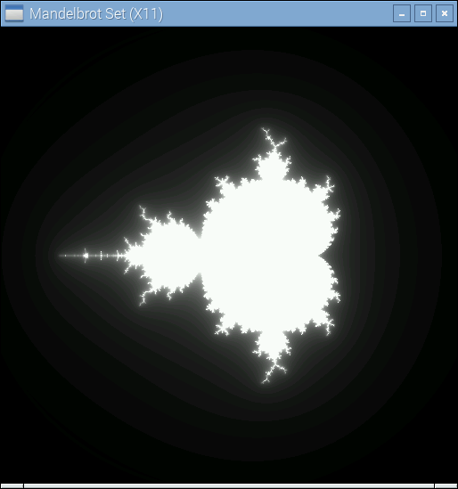
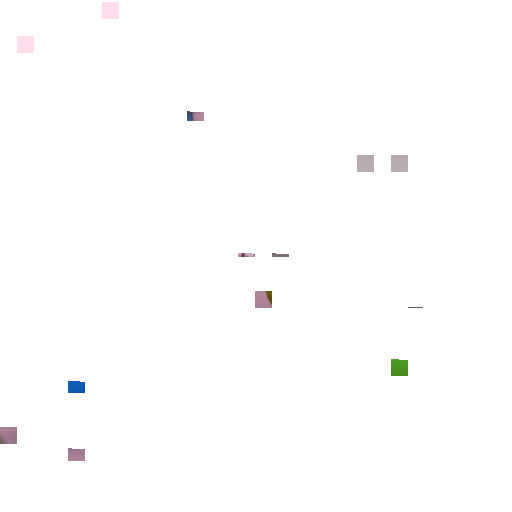
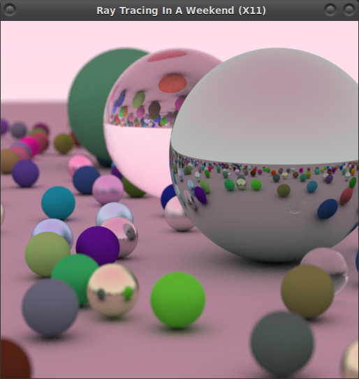
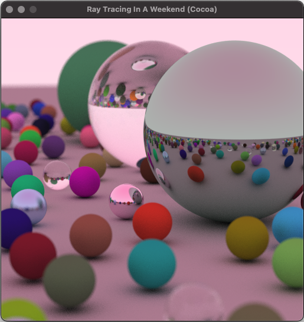
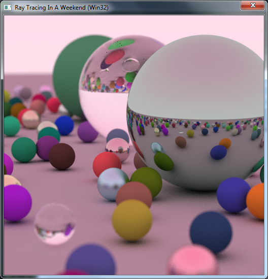
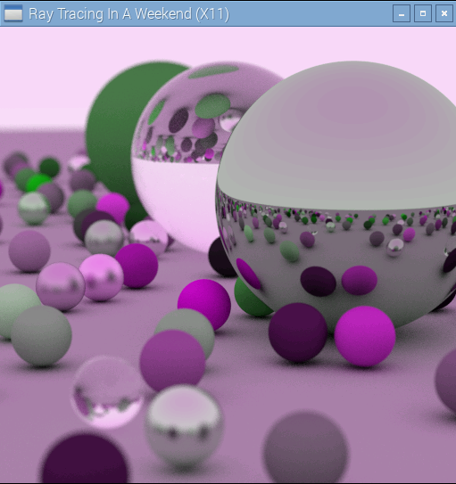

# WUHOO

Wuhoo loosely stands for **W** indows **U** sing **H** eaders **O** nly. It is an attempt to create a single-header library (in the spirit of STB [1]) for graphics related window management, compatible with both C and C++. 

Wuhoo aims to make it easy to setup a system-backed drawing canvas on the three most popular windowing APIs, namely Win32, X11 and Cocoa. If requested, the API can also handle the creation of a modern OpenGL context for the user.

Wuhoo is a single header library. In a single implemetation file, you `#define WUHOO_IMPLEMENTATION` and `#include wuhoo.h`.

## Windows (Win32 API)

Windows API functions that manipulate characters generally provide two versions,

- A Windows code page version with the letter "A" used to indicate "ANSI".
- A Unicode version with the letter "W" used to indicate "wide".

In Wuhoo you `#define WUHOO_UNICODE` or simply `UNICODE` to indicate which version should be used internally. UNICODE might already by defined depending on your compilation settings. In general Wuhoo uses UTF-8 encoding for all string-relevant APIs and handles any required conversion internally.

If you plan to use the OpenGL backend, it is expected that you include your own OpenGL headers before wuhoo itself.

## Linux (X11 API)

When using the X11 backend on Linux, the user has to link with the X11 library (-lX11). If an OpenGL context has been requested, the OpenGL library is also required (-lGL)

Depending on your package manager, you will at least need something like this:

`sudo apt-get install libx11-dev`

## Mac OS X (Cocoa API)

When using the Cocoa backend on Mac OS X the user has to link with the following frameworks (-framework Cocoa, Carbon, Quartz). If an OpenGL context has been requested, the OpenGL framework is also required (-framework OpenGL)

## Examples

To quickly get up and running with Wuhoo, check out the provided examples. Clone this repository with:

`git clone https://github.com/ViNeek/wuhoo.git`

A **cmake** build script is provided. Simply change directory to `wuhoo/examples` and execute

`cmake -D"CMAKE_BUILD_TYPE=Release" -H. -Bbuild`

or with newer **cmake** (>3.13)

`cmake -D"CMAKE_BUILD_TYPE=Release" -S. -Bbuild`

- **Canvas** is a very basic example that allows the user to free draw with the mouse on a system provided buffer. It showcases window setup along with basic window and mouse event handling.

- **Mandelbrot** and **Mandelbrot GL** draw the famous fractal using a system buffer and an OpenGL context respectively.

 

 
 
- **Text** uses another single header library(stb_truetype) to create a very basic text editor. The main focus is on showcasing how character encoding and keyboard events are handled with Wuhoo.

- **Image Viewer** uses stb_image and stb_image_resize to create a basic image previewer. The main focus is on presenting the Drag n Drop event handling. Simply darg an image on the window to present it.

- **RTIOW** is a C++ project that implements a multi-threaded version of the amazing Ray Tracing in One Weekend book. Expect something like this:

 

 

[1] https://github.com/nothings/stb
